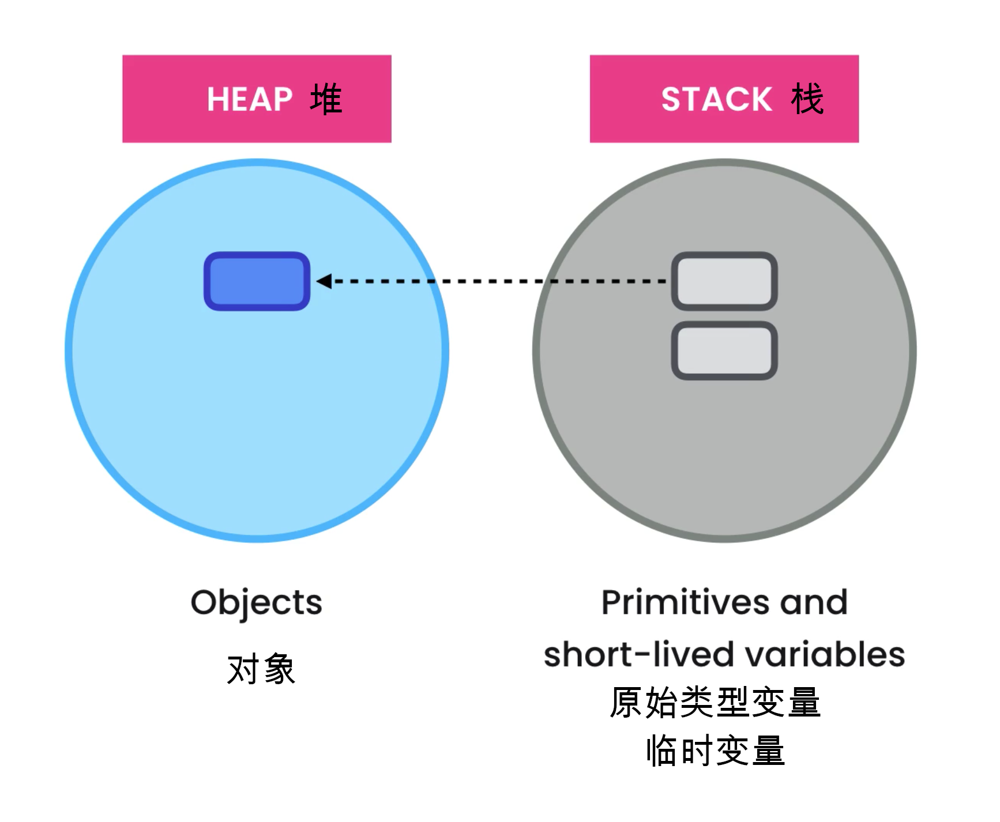



在这个课程里，我们将介绍“面向对象编程（Object-Oriented Programming: OOP）”。请在开始之前，确保已经掌握了以下Java编程的基础知识：

- 变量的声明和使用；
- Java的基本数据类型；
- 函数的定义和使用；
- 控制程序的执行流程；

> **注意：** 从这节课程开始，我们进入了学习Java编程开发的**进阶课程**。
> 
> 在开始之前，请确保你已经完成并掌握了基础课程的内容。上述这些内容都在前面的课程中分别介绍了，确保你已经很好的掌握这些知识。如果你还没有掌握这些基础知识，请回到前面的课程去学习。


很高兴你已经完成了Java基础阶段的学习任务，下面就让我们一起进入进阶课程吧！




在编写计算机程序的时候，我们有多种“编程范式”可以使用。“编程范式”有时也称为“编码风格”，比较流行的“编程范式”有：

- Procedual：过程式
- Functional：函数式
- Object-Oriented：面向对象式
- Event-Driven：事件驱动式
- Logic：逻辑式
- Aspect-Oriented：面向切面式


在所有这些“编程范式”中，函数式编程（Functional Programming: FP）和面向对象编程（Object-Oriented Programming）是最流行的两种。


> **注意：** 编程范式本身不是一种编程语言，它只是我们使用某种编程语言写代码时使用的编码风格。
> 
> 但是，我们也可以编程语言用所支持的编程范式对语言进行分类。比如：像SmallTalk这种编程语言就只支持面向对象编程OOP这一种编程范式，这种单范式的编程语言通常不太流行，使用的人不多；而当前流行的编程语言，像Python、Ruby、Java、Javascript通常都能够支持多种编程范式。

在面向对象编程（OOP）的编程范式中，一切东西都是基于“对象（Object）”这一抽象概念。


这些对象是包含了数据：Data（也称为“状态：State”）和方法：Methord（也称为“行为：Behavior”）的单元，我们总是使用对象的方法来修改对象的数据。

在面向对象编程OOP中，我们将数据和操作数据的方法都封装进一个对象里；而在函数式编程Function-Programming中，我们则使用完全相反的编码风格，认为数据与方法在根本上不同的，我们会把它们分别放在代码的不同地方。


所以，我们说面向对象编程和函数式编程是2种完全不同的编程范式。

可以用这2种范式去解决同一个编程问题，这时我们写出来的代码风格是完全不同的。那么问题来了：哪种编程范式更好呢？

对于这个问题，不同的人会给出不同的答案。有一些人掌握了某种编程范式以后，就会喜欢用这一种编程去解决世界上所有的问题。


也有一些人表示自己非常讨厌面向对象编程OOP的范式，因为他曾经有过一次使用OOP风格开发失败的糟糕经历。


在我看来，这位程序员可能以错误的方式使用了OOP，他没有学习到面向对象编程的正确方法。这不能怪他，问题在于：真正掌握面向对象编程是个复杂的任务，并且现有的大部分书和教程都没能向程序员讲清楚什么才是正确的面向对象编程。

下面回到我们的问题：到底哪种编程范式更好？面向对象式，还是函数式？


答案是：取决于你要解决的问题。

当前我们软件工业中存在的一个显著时弊就是：相比解决问题，程序员开发者对语言、工具、框架更感兴趣。


很多的程序员，甚至是拥有多年开发经验的老手，其实都对“什么叫做解决问题”含糊不清。


他们以为自己知道，但他们并不真正知道。

> **解决问题是一个过程：** 解决问题是一个**定义问题**、定位和比较**不同的解决方案**、选择那个**最适合当下问题场景**并且**最能满足相关约束条件**的方案的**过程**。


一些开发者对开发范式抱有非黑即白的偏见，不顾问题的场景和约束条件，他们一旦找到了自己喜欢的语言和工具，就去用它来解决一切问题。这是错误的！！

回到上面的问题，许多人认为面向对象编程OOP通常更适合创建图形用户界面和游戏；而函数式编程FP则更适合开发那些对可靠性要求极高的程序，或者更适用于那些需要进行大量消息传递和转换的应用场景。

当然，上面这些只是一些关于开发范式的笼统使用建议，千万别把这些建议当成信条。


更觉的情景是，我们会在一个程序的开发中使用多种编程范式：可能在某些部分使用事件驱动范式，因为它更合适，而在其它的程序部分中使用函数式或面向对象编程范式。这一切都取决于我们要解决的问题。没有任何一种编程范式能在所有的场景下都表现最好。


记住：在软件工程领域，一种能完美地解决所有问题的方法是不存在的。每个问题都是不一样的，因此不存在用一种语言、一种范式、一种框架就是最好的说法。一切都取决于：

- 问题本身
- 问题相关的上下文环境和场景
- 解决问题的约束条件：如时间、预算等


千万不要陷入一个固定的单一解决方案而无法自拔，千万不要想着用一把刀就把所有事情全都做掉。

好的，现在我们知道了面向对象编程是一种编程范式，也打破了对范式的迷信。下面就让我们看看使用OOP范式的优势和好处是什么？




在面向对象编程的范式中，一切东西都是对象。这些对象通过与其它对象之间的互动来完成各种程序任务。


我们用一辆车来类比一个程序：一辆车由相互连接的成百上千个零部件构成，几乎所有的部件都是可重复使用、可替换的。如果任意一个部件故障了，工程师可以很方便的把它取出来，用一个正常部件替换它。


一个由多个对象组成的程序也是类似的，使用面向对象的编程范式我们能够获得以下好处：

- 降低复杂度：将一个复杂的大规模的应用系统拆分成由更小、更容易管理、更易维护的多个对象构成。如果某个对象无法正常工作了，我们只需要关注这个对象的代码就能定位到问题，而不用在整个系统的代码汪洋中去大海捞针。
- 更容易维护：定位到故障点后，我们可以修复这个对象的代码，或用一个新对象去替换它，这让我们的代码更容易维护；
- 代码更易于复用：OOP的另一个重要优势就是面向对象编程可以让我们更容易复用现有代码。一旦一个对象的代码通过了构建与测试，我们可以很容易另外的场景或应用中复用这个对象完成相同或类似的功能，减少重复代码。举个例子：假如我们编写了一个图像编辑的应用程序，这个程序中提供了很多用于处理图片的滤镜，一旦实现这些滤镜的代码通过了构建与测试，我们就可以很容易将它们用于其它的图像编辑程序。
- 开发效率更高：使用面向对象编程通常能让我们能用更快的速度开发和维护应用程序。


关于上述OOP的优势也存在一些有趣的争论。比如就有些程序员认为：面向对象编程的上述好处都仅仅存在于理论中，而在真实的应用程序中它们都不成立。因为在真实的应用开发中，他们不会去复用对象，也无法把一个运行中的故障对象用其它对象替换掉。


在我看来，这些程序员的失败是由于他们没有正确的使用面向对象编程OOP。如果你不会正确的使用工具，你就不能就此断言工具是无用的。

也有一些热爱函数式编程的程序员争论说：使用函数式我们也能获得面向对象相同的优势。
确实，这也是事实。但是在这个课程里面，我们不会讨论函数式编程，这里我只希望你能了解：面向对象编程与函数式编程都是很优秀的范式，各有优势，但他们也都不是能在任何情况下都适用的灵丹妙药。希望你能掌握这些范式，并且能根据你要解决的具体问题，明智的选择最合适的编程范式。






在进入学习之前，我们先给出整个Java进阶课程的内容摘要。

1. 类Class：首先，我们会学习“类”，class是构成一个面向对象程序的基础组件。在下一节里面我们将学习什么是类？为什么我们需要使用类来生成对象？以及如何用Java代码创建一个类？
2. 封装与抽象：接着，我们会学习面向对象编程中最重要的2个概念：封装与抽象。这2个概念经常被程序员错误的理解和使用，我将会用一些超级简单的类比和示例代码，让你形成正确的理解。
3. 使用面向对象设计对代码进行重构：如何正确的使用OOP来重构现有代码，写出优雅的、可维护的、可复用的面向对象程序的代码。这是每个Java开发者都应该具备的能力，虽然有一些开发者即使在使用Java编码多年以后，也仍然缺乏这种重要的能力。
4. 继承（Inheritance）与多态（Ploymorphism）：介绍面向对象编程的另外2个重要概念：继承和多态。
5. 接口（Interface）：最后介绍面向对象编程中最强大的，也是最容易实被忽视和误用的工具：接口。在这一部分，我们将学习类之间的耦合关系，以及如何进行解耦。我们会展示相互之间紧密耦合的代码所存在的问题，以及如何使用接口来解决这些问题。


通过Java进阶课程的学习，你将掌握正确的、坚实的面向对象设计的基本原则、核心概念和编码技能，这将帮助你形成关于Java Development Kit: JDK的更好的理解，因为JDK以及以后我们将学习的所有编程开发框架实际上都是一个个结构化的Java类库。熟练掌握面向对象编程，对于进入后面的Java高阶课程，在真实应用场景中写出优秀、高效的Java代码都是必备的先决条件。

好了，铺垫了这么多，下面就让我们正式进入Java面向对象开发的课程学习。




### 类：Class

“类”是面向对象编程中一个最基础的概念。在这个部分，我们将深入细致的学习“类”这个概念，包括以下内容：

- 用类来封装代码的原因和目的，以及如何用Java写出一个“类”；
- 介绍面向对象编程中重要的概念：封装与抽象；这2个概念经常被程序员混淆与误用；
- 构造器函数：Constructor
- 读值函数与写值函数：Getters和Setters
- 成员函数的重载：Method Overloading

打起精神来，这部分的内容有点多，同时这部分也是以后你在阅读和编写面向对象代码时所必需掌握的重要知识。下面让我们进入学习

#### 定义

- 类Class：是创建对象object使用的模板；
- 对象Object：是一个“类Class”的实例化；

#### 举例


上面我们定义了一个汽车的类：

- 在上面的部分，我们声明了各种与汽车有关的各种信息，比如：它是什么状态的？起动或停止的、当前的行驶速度是多少？当前的档位是什么？等等……这些信息我们称之为类的“属性（Fields/Attributes）”。类的属性用来保存一辆汽车的状态数据和信息，起停状态、行驶速度、档位等。
- 在下面的部分，我们声明了汽车相关的各种行为，比如：起动、停止、加速、刹车、换档……等等。这些行为我们称之为类的“方法（Methods/Fuction）”，当我们调用这些方法时，类的状态数据就会发生改变。比如：调用换档方法changeGear后，上面的值currentGear值就会变化。
- 如此声明的一个汽车类就是我们创建汽车对象时所使用的模板或称之为蓝本。我们就可以基于这个“汽车的类”，创建一系列的“汽车的对象”：car1、car2、car3……
- 使用相同的汽车类创建的多个汽车对象都有完全相同的属性，但他们这些属性的取值是完全独立、不相关的。比如：car1和car2都有当前档位，但是档位取值是独立的，car1的档位、速度、起停状态取值可以与car2不一样，它们是2个独立的对象，代表2辆不同的汽车。

> **UML：统一建模语言** 这里我们使用了一种被称为UML（Unified Modeling Language）的图形化标准语言来表示“类”和“对象”。软件开发领域里，我们经常使用UML图形来可视化的呈现类及其相互之间的关联。


接下来再看一个关于“电灯”的例子：

- 灯Lamp类只有一个属性，取值只有2种可能的状态：开或者关，我们可以用一个布尔类型的变量isOn进行表示。
- 相应的方法也只有2种：打开turnOn或关闭turnOff。


下面再看看电视类应该有哪些属性和方法？

- 属性：当前的音量、频道，当前的开关机状态
- 方法：加大音量、减小音量、开机、关机、切换频道……等等


但是等等，我们的程序中通常并没有汽车、电视这种东西，能不能再举一个程序中会经常出现的、更实际些的类和对象的例子呢？

让我们来看看这个输入框例子：


输入框textbox无处不在，比如上面我们可以用textbox来输入邮件和地址信息。那么，一个输入框应该有哪些属性和方法呢？


- 属性：当前的文本字符串、允许输入的最大字符限制、当前显示的字符宽度、是不是获得了用户的输入焦点……等等；
- 方法：设置字符串、清空、enable、disable……等等；

现在我们已经掌握了“类”和“对象”的概念，下面我们学习如何使用Java语言来创建“类”和“对象”。




使用Apache Maven创建一个空白项目：https://maven.apache.org/


```bash
mvn archetype:generate -DgroupId=java_tutorial -DartifactId=demo -DarchetypeArtifactId=maven-archetype-quickstart -DarchetypeVersion=1.4 -DinteractiveMode=false
```

Java使用单独的文件来保存每一个类的代码，创建一个文件TextBox.java：

todo

在TextBox.java文件中输入以下代码：
```java
public class TextBox{
    public String text;
    
    public void setText(String text){
        this.text = text;
    }

    public void clear(){
        this.text = "";
    }
}
```

好了，至此我们已经拥有了一个TextBox类，下面我们学习如何用这个类来创建文本框对象。



回到我们的Main.java类，开始编写代码：
```java
public class Main{
    public static void main(String[] args){
        // 使用var关键字定义变量，自动推断变量类型：jdk.version >= 10
        var textBox1 = new TextBox();

        // 这行会报错，因为Java是一种静态类型的语言。Java变量的类型一旦确定了，就不能再改变
        // textBox1 = 1;

        textBox1.setText("Box 1"); //想一想：如果注释掉这行，程序会输出什么？
        System.out.println(textBox1.text);
    }
}
```

> 注意：java 10以上的版本中，我们可以使用var定义引用变量，让Java编译器自动推断变量的类型。
>
> Java类的成员变量如果不赋初始值，将会被自动初始化为null空值。
>
> 如果不先调用对象的setText方法设置text值，就直接调用对象text属性的方法toUpperCase()，程序运行将会丢出一个空指针异常:java.lang.NullPointerException


修复这个问题，只需要在定义属性text的时候指定变量的初始值即可：
```java
public class TextBox{
    //声明属性时，设置初始值为空字符串对象
    public String text = "";
    
    public void setText(String text){
        this.text = text;
    }

    public void clear(){
        this.text = "";
    }
}
```

用一个类可以创建多个不同的对象，这些对象的状态相互之间是独立的。
```java
public class Main{
    public static void main(String[] args){
        var textBox1 = new TextBox();
        textBox1.setText("Box 1");
        System.out.println(textBox1.text.toUpperCase());

        var textBox2 = new TextBox();
        textBox2.setText("Box 2");
        System.out.println(textBox2.text);
    }
}
```




下面我们来学习一个很重要的知识点：Java的内存管理。也就是：当我们用Java代码创建一个对象的时候，背后到底发生了什么？




Java的内存分配机制：

- 所有的对象都在“堆Heap”上分配内存；
- 所有的原始类型和本地临时亦是都在“栈Stack”上分配内存；

Java程序有2个内存区域：一个称为“堆（Heap）”，它是Java用来保存所有对象的区域；另一个称为“栈（Stack）”，用来保存所有的原始类型变量和临时的引用变量。

让我们写出下面的代码：
```java
public class Main {
    public static void main(String[] args) {
        var textBox1 = new TextBox();
        var textBox2 = textBox1;

        textBox2.setText("Hello World");
        System.out.println(textBox1.text);

        textBox1.clear();
        System.out.println(textBox2.text);
    }
}
```

> 注意：textBox1和textBox2是2个定义的栈上的临时引用变量，它们都引用了同一个定义在堆上的TextBox对象。改变一个变量属性的值，将会引起另一个变量的属性值也跟着一起改变。

这里顺便也介绍一下Java的内存回收机制：

- 在栈Stack上分配的内存，即临时引用变量所占用的内存将在函数退出后立即回收；
- 在堆Heap上分配的内存，即那些对象所占用的内在，Java虚拟机会有一个单独的进程保存所有对象的引用计数器，当这个引用计数器为零时，这个进程会将该对象标识为垃圾对象并选择一个恰当的时机回收它所占用的内存。这个进程就叫垃圾收集进程（GC: Garbege Collection）；

> 注意：Java与C++语言不同，我们写代码的时候通常不需要关心内存的回收，Java会自动为我们回收不再使用的变量所占用的内存空间。

以上，就是目前我们关于Java内存管理所需要知道的全部知识。




在前面的内容里面，我已经为你们介绍了面向对象编程的优点，在下面的教程里，我将用一个程序例子来展示这些优点。

- 首先，我们会用过程式的编程范式开发这个程序，过程式就是将程序拆分为函数，通过函数调用来实现程序功能，这是我们在学习面向对象编程之前使用的编程方法，我们会讨论过程式编程范式存在的问题；
- 接着，我们会试着用面向对象的编程范式，把这个过程式的程序改成面向对象式的，在这个过程中，我们就会亲身体会到OOP所提供的优势和好处；

### 案例：计算员工每月工资的程序

\(Wage=baseSalary + (extraHours \times hourlyRate)\)

- Wage: 员工本月的工资
- baseSalary: 基本工资
- extraHours: 加班小时数
- hourlyRate: 加班每小时工资

```java
public class Main {
    public static void main(String[] args) {
        int baseSalary = 5_000;
        int extraHours = 30;
        int hourlyRate = 30;

        int wage = calculateWage(baseSalary, extraHours, hourlyRate);
        System.out.println(wage);
    }

    public static int calculateWage(
        int baseSalary,
        int extraHours,
        int hourlyRate)
    {
        return baseSalary + (extraHours * hourlyRate);
    }
}
```

单独看这个程序，其实过程式编程的问题其实并不明显，main函数只有5行，calculateWage函数只有1行代码。但是是，如果你想扩展这个程序，比如我将加入一些新的功能，我们就一定会得到一个更为臃肿的main函数。确实，我们可以通过不断地将代码封装成新的函数解决这个问题，但是我们的Main类就会变得非常臃肿。这就是过程式编程的风格，我们没有类和对象的概念，我们有的只是一堆的变量和一堆用来操作这些变量的函数。


讲一个有趣的事情：我见过一些程序员就是用上面这种方式写代码的，但是他们却自以为是在写面向对象的代码，仅仅是因为他们听说Java是一门面向对象的编程语言，而他们的Java程序总是有一个Main类，并且代码中也确实使用了一些其它的类，于是他们就认为自己是在进行面向对象编程。这是错误的。

仅仅只是在代码中使用了类和对象，并不意味着我们就是在进行面向对象编程。OOP不仅仅只是使用类和对象，真正的面向对象编程是包含了许多概念和技术的组合，我们将在下面的课程中一一掌握学习它们。

回到上面的代码中，虽然我们把代码都放到一个类里面，但它确仍是过程式编程。过程式编程导致的代码问题有以下：
- calculateWage函数有较多的参数（3个）：这虽然不算太多，我经常见到过程式开发的代码中，函数有5到10个参数的。如果发现你的代码中也有这种函数参数越来越多的症状，那么你大概不是在进行面向对象编程，而是在进行过程式编程。
- 用过程式写的程序更难以维护：当程序出现问题时，我们必需查看更多的位置，检查更多的代码，更小心的评估修改方案。因为在这种代码里，一旦我们修改一处地方，可能很多地方都会出问题，导致更多的程序故障和缺陷；
- 过程式写的代码更难被复用：你会得到一堆的函数，它们散落在程序代码的各处，如果你想复用代码，你经常需要从这里拷贝一些代码，从那边复制一些代码，而且很难让这些代码在一起正常工作，因为函数参数各处不一致，而且参数还很多。时间长了，代码就会变得一团糟，不同参数的函数调用相互缠绕成一堆，我们管这种代码为“意大利面”，所有的东西就像面条一样相互缠绕在一起，这时候要修改程序代码就变得很困难了。

在下面的课程中，我们会修改上面这个计算工资的程序，把它变成面向对象风格的代码。



在这一节中，我们将展示面向对象编程的第一个重要概念：封装Encapsulation。

> 封装：将数据和操作数据的方法打包在一起，放到一个单独的类里面去，这就叫做“封装”。

我们观察这个过程式代码：
```java
public class Main {
    public static void main(String[] args) {
        // 这三个是程序所操作的数据：
        int baseSalary = 5_000;
        int extraHours = 30;
        int hourlyRate = 30;

        int wage = calculateWage(baseSalary, extraHours, hourlyRate);
        System.out.println(wage);
    }

    // 这个是操作数据的方法
    public static int calculateWage(
        int baseSalary,
        int extraHours,
        int hourlyRate)
    {
        return baseSalary + (extraHours * hourlyRate);
    }
}
```

封装：把数据和操作数据的方法打包到一个单独类中。由于我们是在计算员工的工资，很自然我们能想到创建一个员工Employee类，把数据和方法封装到这个Employee类中就行了。

### 员工类：Employee.java
```java
public class Employee {
    public int baseSalary;
    public int hourlyRate;
    public int extraHours;

    // 这里不再需要传参数了，这是面向对象风格的重要特征 
    public int calculateWage() {
        return baseSalary + (extraHours * hourlyRate);
    }
}
```

### 员工类：Employee.java（改进：把加班时长信息extraHours从员工信息中移出）
```java
public class Employee {
    public int baseSalary;
    public int hourlyRate;

    public int calculateWage(int extraHours) {
        return baseSalary + (extraHours * hourlyRate);
    }
}
```

### 主程序类：Main.java
```java
public class Main {
    public static void main(String[] args) {
        var employee = new Employee();
        employee.baseSalary = 5_000;
        employee.hourlyRate = 30;

        int wage = employee.calculateWage(20);
        System.out.println(wage);
    }
}
```

这个程序还存在一些问题，我们会在下一节中处理。




好了，通过把baseSalary和hourlyRate变成员工类Employee的属性，以及把calcualteWage函数变成员工类的方法，我们已经完成了数据的封装。

但是，我们还有一些问题。

比如：对员工的属性赋值是由Main类直接操作的，如果用户的信息中可能存在非法数值怎么办？

```java
public class Main {
    public static void main(String[] args) {
        var employee = new Employee();
        employee.baseSalary = -1; //如果用户输入了非法的数值怎么办？
        employee.hourlyRate = 30;

        // 注意：在这里验证是槽糕的设计！！
        // if (employee.baseSalary <=0 ) ...
        int wage = employee.calculateWage(20);
        System.out.println(wage);
    }
}
```

### 员工类：Employee.java（在setter函数中进行数据合法性的验证）
```java
public class Employee {
    private int baseSalary; //private 将属性变成私有的
    public int hourlyRate; // 请把这个属性也改成private，并为其添加getter和setter函数

    public int calculateWage(int extraHours) {
        return baseSalary + (extraHours * hourlyRate);
    }

    public void setBaseSalary(int baseSalary) {
        if(baseSalary < 0)
            throw new IllegalArgumentException("基本工资不能小于等于0");
        this.baseSalary = baseSalary;
    }

    public int getBaseSalary() {
        return this.baseSalary;
    }
}
```























